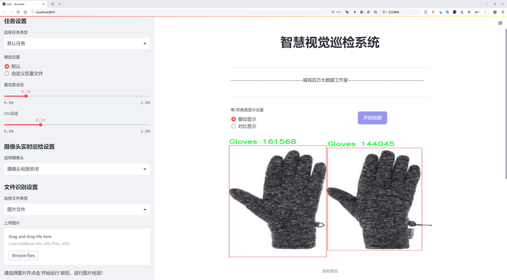
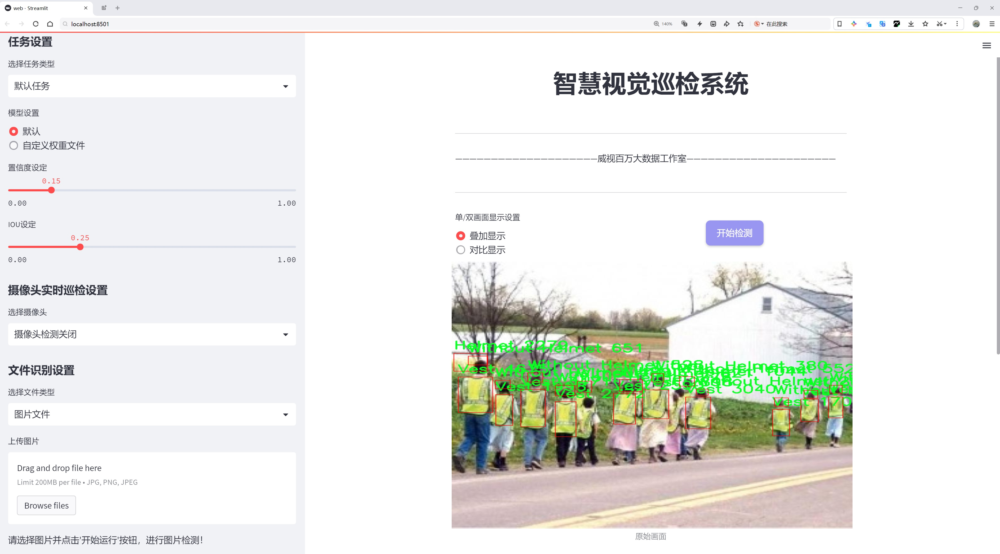
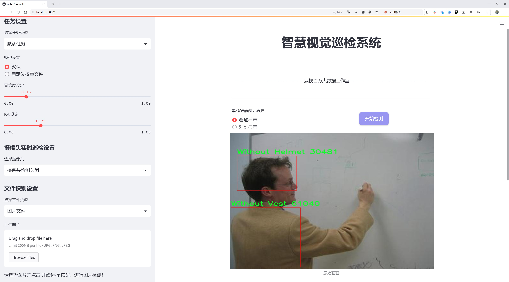
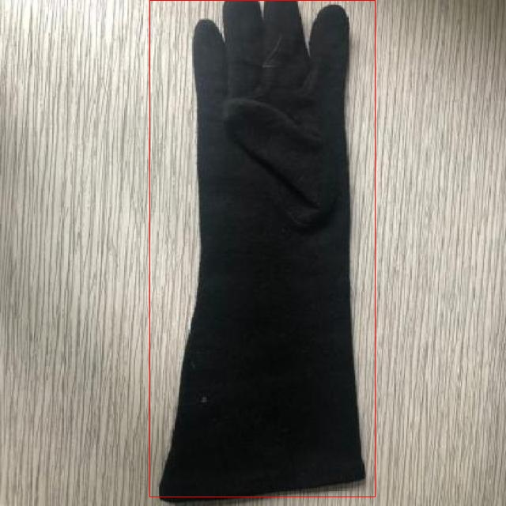
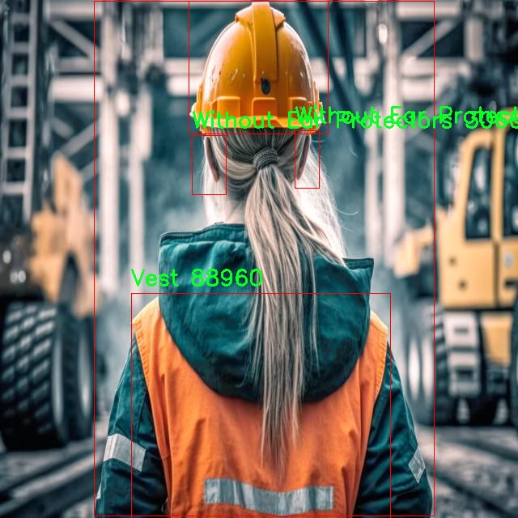
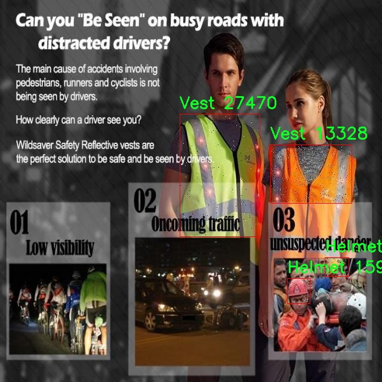
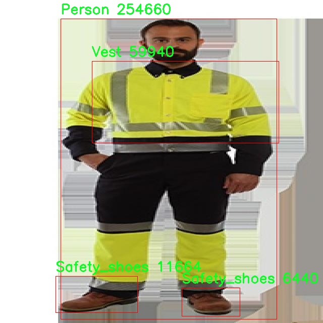
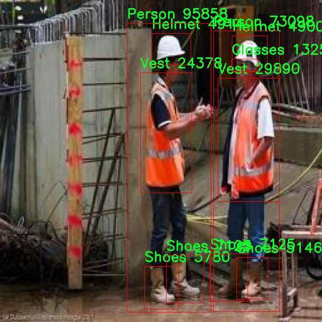

# 个人防护装备检测检测系统源码分享
 # [一条龙教学YOLOV8标注好的数据集一键训练_70+全套改进创新点发刊_Web前端展示]

### 1.研究背景与意义

项目参考[AAAI Association for the Advancement of Artificial Intelligence](https://gitee.com/qunmasj/projects)

项目来源[AACV Association for the Advancement of Computer Vision](https://kdocs.cn/l/cszuIiCKVNis)

研究背景与意义

随着工业化进程的加快和城市化的不断推进，个人防护装备（PPE）的使用变得愈发重要。个人防护装备不仅能够有效降低工人在工作环境中遭受伤害的风险，还能提升整体的安全管理水平。根据国际劳工组织（ILO）的统计，全球每年因工作相关事故导致的死亡人数高达20万人，而这些事故中相当一部分是由于缺乏有效的个人防护措施所致。因此，开发一个高效、准确的个人防护装备检测系统显得尤为迫切。

在这一背景下，计算机视觉技术的迅猛发展为个人防护装备的检测提供了新的解决方案。尤其是基于深度学习的目标检测算法，如YOLO（You Only Look Once）系列，因其高效性和实时性而受到广泛关注。YOLOv8作为该系列的最新版本，具备更强的特征提取能力和更快的推理速度，能够在复杂的工作环境中实现对个人防护装备的精准识别和分类。然而，尽管YOLOv8在目标检测领域表现出色，但在特定应用场景下，仍然存在一定的局限性，例如对小目标的检测精度不足、背景干扰影响等。因此，针对YOLOv8进行改进，以提升其在个人防护装备检测中的性能，具有重要的研究意义。

本研究将基于PPE 2数据集，构建一个改进的YOLOv8个人防护装备检测系统。该数据集包含8700张图像，涵盖16个类别，包括耳保护器、眼镜、手套、头盔、口罩等多种个人防护装备，以及相应的无防护装备状态。这一丰富的类别设置不仅能够帮助系统全面识别不同类型的个人防护装备，还能有效地进行无防护状态的检测，从而为安全管理提供重要的数据支持。

通过对YOLOv8的改进，本研究旨在提高系统对不同种类个人防护装备的检测精度，尤其是在复杂背景下的小目标检测能力。此外，研究还将探索如何利用数据增强、模型集成等技术，进一步提升模型的鲁棒性和适应性。最终，构建的检测系统将能够实时监测工人是否佩戴了必要的个人防护装备，为企业的安全管理提供有力的技术支持。

本研究的意义不仅在于推动目标检测技术在工业安全领域的应用，更在于为保障工人安全、减少工作场所事故提供科学依据。通过实现对个人防护装备的智能检测，能够有效提升企业的安全管理水平，降低事故发生率，从而为构建安全、健康的工作环境贡献力量。此外，研究成果还可为后续相关领域的研究提供参考，推动计算机视觉技术在更广泛的安全监测和管理中的应用。因此，基于改进YOLOv8的个人防护装备检测系统的研究，具有重要的理论价值和实际意义。

### 2.图片演示







##### 注意：由于此博客编辑较早，上面“2.图片演示”和“3.视频演示”展示的系统图片或者视频可能为老版本，新版本在老版本的基础上升级如下：（实际效果以升级的新版本为准）

  （1）适配了YOLOV8的“目标检测”模型和“实例分割”模型，通过加载相应的权重（.pt）文件即可自适应加载模型。

  （2）支持“图片识别”、“视频识别”、“摄像头实时识别”三种识别模式。

  （3）支持“图片识别”、“视频识别”、“摄像头实时识别”三种识别结果保存导出，解决手动导出（容易卡顿出现爆内存）存在的问题，识别完自动保存结果并导出到tempDir中。

  （4）支持Web前端系统中的标题、背景图等自定义修改，后面提供修改教程。

  另外本项目提供训练的数据集和训练教程,暂不提供权重文件（best.pt）,需要您按照教程进行训练后实现图片演示和Web前端界面演示的效果。

### 3.视频演示

[3.1 视频演示](https://www.bilibili.com/video/BV1yKsDeMEeR/)

### 4.数据集信息展示

##### 4.1 本项目数据集详细数据（类别数＆类别名）

nc: 16
names: ['Ear Protectors', 'Glasses', 'Gloves', 'Helmet', 'Mask', 'Person', 'Safety_shoes', 'Shoes', 'Vest', 'Without Ear Protectors', 'Without Glass', 'Without Glove', 'Without Helmet', 'Without Mask', 'Without Shoes', 'Without Vest']


##### 4.2 本项目数据集信息介绍

数据集信息展示

在现代工业和建筑环境中，个人防护装备（PPE）的使用至关重要。为了提高安全性和降低事故发生率，开发一个高效的个人防护装备检测系统显得尤为重要。本研究中使用的数据集名为“PPE 2”，其主要目的是为改进YOLOv8模型在个人防护装备检测方面的性能提供支持。该数据集包含16个类别，涵盖了多种类型的个人防护装备及其缺失状态，确保了检测系统的全面性和准确性。

“PPE 2”数据集的类别列表包括了多种常见的个人防护装备，如耳保护器、眼镜、手套、安全帽、口罩、安全鞋以及反光背心等。这些装备在工业和建筑领域中扮演着保护工人免受潜在伤害的重要角色。具体而言，数据集中包含的类别有：耳保护器（Ear Protectors）、眼镜（Glasses）、手套（Gloves）、安全帽（Helmet）、口罩（Mask）、人（Person）、安全鞋（Safety_shoes）、鞋（Shoes）、反光背心（Vest）等。此外，数据集还包括了这些装备缺失的状态，如“没有耳保护器”（Without Ear Protectors）、“没有眼镜”（Without Glass）、“没有手套”（Without Glove）、“没有安全帽”（Without Helmet）、“没有口罩”（Without Mask）、“没有鞋”（Without Shoes）、“没有反光背心”（Without Vest）。这种设计不仅能够帮助模型识别佩戴的装备，还能有效识别出缺失的装备，从而为安全管理提供重要的数据支持。

数据集的构建过程考虑到了多样性和现实场景的复杂性。每个类别的样本均来自于不同的工作环境和场景，确保了数据集的广泛适用性和代表性。这些样本不仅包括了不同种类的个人防护装备，还涵盖了不同的人体姿态、光照条件和背景环境，使得模型在训练过程中能够学习到更加丰富的特征。这种多样性有助于提高模型在实际应用中的鲁棒性，确保其能够在各种环境下准确识别个人防护装备的佩戴情况。

此外，数据集的标注工作经过严格的审核和验证，确保每个样本的标注信息准确无误。这对于训练深度学习模型至关重要，因为准确的标注能够直接影响模型的学习效果和最终的检测性能。通过使用“PPE 2”数据集，研究人员能够在YOLOv8模型的基础上进行更为深入的改进和优化，从而提升其在个人防护装备检测任务中的表现。

总之，“PPE 2”数据集不仅为改进YOLOv8模型提供了丰富的训练数据，还为个人防护装备的智能检测系统的开发奠定了坚实的基础。通过对该数据集的深入分析和利用，研究人员能够更好地理解和应对个人防护装备在实际应用中的挑战，从而为提升工人安全和健康水平做出积极贡献。











### 5.全套项目环境部署视频教程（零基础手把手教学）

[5.1 环境部署教程链接（零基础手把手教学）](https://www.ixigua.com/7404473917358506534?logTag=c807d0cbc21c0ef59de5)


[5.2 安装Python虚拟环境创建和依赖库安装视频教程链接（零基础手把手教学）](https://www.ixigua.com/7404474678003106304?logTag=1f1041108cd1f708b01a)

### 6.手把手YOLOV8训练视频教程（零基础小白有手就能学会）

[6.1 手把手YOLOV8训练视频教程（零基础小白有手就能学会）](https://www.ixigua.com/7404477157818401292?logTag=d31a2dfd1983c9668658)

### 7.70+种全套YOLOV8创新点代码加载调参视频教程（一键加载写好的改进模型的配置文件）

[7.1 70+种全套YOLOV8创新点代码加载调参视频教程（一键加载写好的改进模型的配置文件）](https://www.ixigua.com/7404478314661806627?logTag=29066f8288e3f4eea3a4)

### 8.70+种全套YOLOV8创新点原理讲解（非科班也可以轻松写刊发刊，V10版本正在科研待更新）

由于篇幅限制，每个创新点的具体原理讲解就不一一展开，具体见下列网址中的创新点对应子项目的技术原理博客网址【Blog】：


[8.1 70+种全套YOLOV8创新点原理讲解链接](https://gitee.com/qunmasj/good)

### 9.系统功能展示（检测对象为举例，实际内容以本项目数据集为准）

图9.1.系统支持检测结果表格显示

  图9.2.系统支持置信度和IOU阈值手动调节

  图9.3.系统支持自定义加载权重文件best.pt(需要你通过步骤5中训练获得)

  图9.4.系统支持摄像头实时识别

  图9.5.系统支持图片识别

  图9.6.系统支持视频识别

  图9.7.系统支持识别结果文件自动保存

  图9.8.系统支持Excel导出检测结果数据


### 10.原始YOLOV8算法原理

原始YOLOv8算法原理

YOLOv8算法是YOLO系列的最新版本，代表了单阶段目标检测技术的一个重要进步。该算法不仅在检测精度上有显著提升，同时在检测速度方面也表现出色，成为了计算机视觉领域中备受关注的研究方向。YOLOv8的架构设计精巧，主要由输入模块、Backbone骨干网络、Neck特征融合网络和Head检测模块四个部分组成。通过对这些模块的优化和改进，YOLOv8能够在多种复杂场景下实现高效的目标检测。

在输入模块中，YOLOv8对输入图像进行了一系列预处理操作。这些操作包括图像比例调整、Mosaic增强和瞄点计算等。Mosaic增强技术通过将多张图像拼接在一起，增加了训练数据的多样性，从而提升了模型的泛化能力。瞄点计算则有助于提高目标定位的精度，为后续的特征提取和检测奠定了基础。

YOLOv8的Backbone部分沿用了DarkNet结构，但在此基础上进行了创新，采用了C2f模块替代了传统的C3模块。C2f模块通过增加更多的残差连接，能够更有效地保留梯度信息，从而在保持轻量化特性的同时，增强了特征提取的能力。此外，YOLOv8在不同尺度模型中调整了通道数，以适应不同的目标检测需求，确保了模型在各种场景下的表现都能达到最优。

在特征图的处理方面，YOLOv8引入了SPPF模块，通过不同内核尺寸的池化操作对特征图进行合并。这一过程不仅提升了特征图的表达能力，还为后续的特征融合提供了丰富的信息。经过SPPF模块处理后的特征图被传递至Neck部分，进行进一步的特征融合。

Neck部分采用了“双塔结构”，结合了特征金字塔网络（FPN）和路径聚合网络（PAN），有效促进了语义特征和定位特征的转移。这种设计使得YOLOv8能够更好地处理不同尺度的目标，提升了对小目标的检测能力。通过这种特征融合，YOLOv8在复杂场景下的目标检测性能得到了显著增强。

在Head检测模块中，YOLOv8采用了解耦合头结构，将分类和回归任务分离开来。这一创新设计使得模型的训练和推理过程更加高效，能够加速模型的收敛。此外，YOLOv8还摒弃了传统的Anchor-Based方法，转而采用Anchor-Free的检测策略。这一转变不仅提高了检测精度，还减少了模型的复杂性，使得YOLOv8在实际应用中更具灵活性。

YOLOv8在训练过程中引入了多种数据增强技术，以提升模型的鲁棒性和泛化能力。其中，动态Task-Aligned Assigner样本分配策略的使用，使得模型在处理正负样本时能够更加高效，确保了训练过程的稳定性。在损失计算方面，YOLOv8采用了BCELoss作为分类损失，DFLLoss和CIoULoss作为回归损失。这种损失函数的选择使得模型在优化过程中能够更好地平衡分类和回归任务的需求。

总的来说，YOLOv8算法通过一系列的结构优化和创新设计，极大地提升了目标检测的性能。其在处理复杂场景、提高检测精度和速度方面的优势，使得YOLOv8成为了当前目标检测领域的重要工具。随着YOLOv8的不断发展和应用，未来在更广泛的领域中，其潜力和价值将进一步得到体现。


### 11.项目核心源码讲解（再也不用担心看不懂代码逻辑）

#### 11.1 70+种YOLOv8算法改进源码大全和调试加载训练教程（非必要）\ultralytics\models\nas\__init__.py

下面是对给定代码的逐文件分析，并保留核心部分，同时对代码进行了详细的中文注释。

```python
# Ultralytics YOLO 🚀, AGPL-3.0 license

# 从当前包中导入 NAS 模型类
from .model import NAS

# 从当前包中导入 NAS 预测器类
from .predict import NASPredictor

# 从当前包中导入 NAS 验证器类
from .val import NASValidator

# 定义该模块的公共接口，允许外部访问 NASPredictor、NASValidator 和 NAS
__all__ = 'NASPredictor', 'NASValidator', 'NAS'
```

### 代码分析与注释

1. **模块导入**：
   - `from .model import NAS`：从当前模块的 `model` 文件中导入 `NAS` 类，`NAS` 可能是一个用于构建神经网络模型的类。
   - `from .predict import NASPredictor`：从当前模块的 `predict` 文件中导入 `NASPredictor` 类，`NASPredictor` 可能用于对输入数据进行预测。
   - `from .val import NASValidator`：从当前模块的 `val` 文件中导入 `NASValidator` 类，`NASValidator` 可能用于验证模型的性能。

2. **公共接口定义**：
   - `__all__ = 'NASPredictor', 'NASValidator', 'NAS'`：定义了该模块的公共接口，表示当使用 `from module import *` 时，只会导入 `NASPredictor`、`NASValidator` 和 `NAS` 这三个类。这是一种控制模块导出内容的方式，确保只暴露必要的部分给外部使用。

### 核心部分总结
- 该代码的核心部分在于导入模型、预测器和验证器类，并定义了模块的公共接口。这为使用 YOLO（You Only Look Once）模型的相关功能提供了基础。

这个文件是一个Python模块的初始化文件，位于Ultralytics YOLO项目的`nas`目录下。文件的开头包含了一个注释，指出这是Ultralytics YOLO项目的一部分，并且该项目遵循AGPL-3.0许可证。

在这个文件中，主要进行了几个重要的操作。首先，它从同一目录下导入了三个类：`NAS`、`NASPredictor`和`NASValidator`。这些类分别代表了与神经架构搜索（NAS）相关的模型、预测器和验证器。通过导入这些类，用户可以在其他模块中使用它们，而不需要重复编写导入语句。

最后，文件通过`__all__`变量定义了模块的公共接口。这个变量是一个元组，包含了三个字符串，分别是`'NASPredictor'`、`'NASValidator'`和`'NAS'`。这意味着当使用`from module import *`语句时，只会导入这三个类，而不会导入其他未列出的类或函数。这种做法有助于控制模块的可见性和使用，确保用户只接触到模块的核心功能。

总体来说，这个文件的主要功能是组织和管理与NAS相关的类，使得它们能够被其他部分的代码方便地使用。

#### 11.2 ui.py

以下是代码中最核心的部分，并附上详细的中文注释：

```python
import sys
import subprocess

def run_script(script_path):
    """
    使用当前 Python 环境运行指定的脚本。

    Args:
        script_path (str): 要运行的脚本路径

    Returns:
        None
    """
    # 获取当前 Python 解释器的路径
    python_path = sys.executable

    # 构建运行命令，使用 streamlit 运行指定的脚本
    command = f'"{python_path}" -m streamlit run "{script_path}"'

    # 执行命令
    result = subprocess.run(command, shell=True)
    # 检查命令执行的返回码，若不为0则表示出错
    if result.returncode != 0:
        print("脚本运行出错。")

# 实例化并运行应用
if __name__ == "__main__":
    # 指定要运行的脚本路径
    script_path = "web.py"  # 这里可以直接指定脚本路径

    # 调用函数运行脚本
    run_script(script_path)
```

### 代码说明：
1. **导入模块**：
   - `sys`：用于访问与 Python 解释器紧密相关的变量和函数。
   - `subprocess`：用于创建新进程、连接到它们的输入/输出/错误管道，并获得返回码。

2. **定义 `run_script` 函数**：
   - 该函数接收一个脚本路径作为参数，并使用当前 Python 环境来运行该脚本。
   - `sys.executable` 获取当前 Python 解释器的路径。
   - 使用 `subprocess.run` 执行构建的命令，并检查返回码以确定脚本是否成功运行。

3. **主程序块**：
   - 通过 `if __name__ == "__main__":` 确保该代码块仅在直接运行脚本时执行。
   - 指定要运行的脚本路径，并调用 `run_script` 函数来执行该脚本。

这个程序文件名为 `ui.py`，其主要功能是使用当前的 Python 环境来运行一个指定的脚本。代码中首先导入了必要的模块，包括 `sys`、`os` 和 `subprocess`，以及一个自定义模块 `QtFusion.path` 中的 `abs_path` 函数。

在 `run_script` 函数中，首先获取当前 Python 解释器的路径，存储在 `python_path` 变量中。接着，构建一个命令字符串，命令的格式是使用 Python 解释器来运行 `streamlit` 模块，并指定要运行的脚本路径。这个命令使用了 `subprocess.run` 方法来执行，`shell=True` 参数表示在一个新的 shell 中执行这个命令。

如果脚本运行过程中出现错误，返回的 `returncode` 不为 0，程序会打印出“脚本运行出错”的提示信息。

在文件的最后部分，使用 `if __name__ == "__main__":` 语句来确保当该文件作为主程序运行时，才会执行下面的代码。这里指定了要运行的脚本路径为 `web.py`，并调用 `run_script` 函数来执行这个脚本。

整体来看，这个程序的设计目的是为了方便地通过一个主程序来运行另一个 Python 脚本，特别是使用 `streamlit` 进行 Web 应用开发时。

#### 11.3 70+种YOLOv8算法改进源码大全和调试加载训练教程（非必要）\ultralytics\utils\autobatch.py

以下是代码中最核心的部分，并附上详细的中文注释：

```python
import numpy as np
import torch
from ultralytics.utils import LOGGER, colorstr
from ultralytics.utils.torch_utils import profile

def check_train_batch_size(model, imgsz=640, amp=True):
    """
    检查YOLO训练的最佳批量大小。

    参数:
        model (torch.nn.Module): 要检查批量大小的YOLO模型。
        imgsz (int): 用于训练的图像大小。
        amp (bool): 如果为True，则在训练中使用自动混合精度（AMP）。

    返回:
        (int): 使用autobatch()函数计算的最佳批量大小。
    """
    with torch.cuda.amp.autocast(amp):
        return autobatch(deepcopy(model).train(), imgsz)  # 计算最佳批量大小

def autobatch(model, imgsz=640, fraction=0.60, batch_size=16):
    """
    自动估计YOLO模型的最佳批量大小，以使用可用CUDA内存的一部分。

    参数:
        model (torch.nn.Module): 要计算批量大小的YOLO模型。
        imgsz (int, optional): 用作YOLO模型输入的图像大小。默认为640。
        fraction (float, optional): 要使用的可用CUDA内存的比例。默认为0.60。
        batch_size (int, optional): 如果检测到错误时使用的默认批量大小。默认为16。

    返回:
        (int): 最佳批量大小。
    """
    
    # 检查设备
    prefix = colorstr('AutoBatch: ')
    LOGGER.info(f'{prefix}计算图像大小为{imgsz}的最佳批量大小')
    device = next(model.parameters()).device  # 获取模型所在设备
    if device.type == 'cpu':
        LOGGER.info(f'{prefix}未检测到CUDA，使用默认CPU批量大小 {batch_size}')
        return batch_size
    if torch.backends.cudnn.benchmark:
        LOGGER.info(f'{prefix} ⚠️ 需要torch.backends.cudnn.benchmark=False，使用默认批量大小 {batch_size}')
        return batch_size

    # 检查CUDA内存
    gb = 1 << 30  # 字节转换为GiB (1024 ** 3)
    properties = torch.cuda.get_device_properties(device)  # 获取设备属性
    t = properties.total_memory / gb  # 总内存（GiB）
    r = torch.cuda.memory_reserved(device) / gb  # 已保留内存（GiB）
    a = torch.cuda.memory_allocated(device) / gb  # 已分配内存（GiB）
    f = t - (r + a)  # 可用内存（GiB）
    LOGGER.info(f'{prefix}{device} ({properties.name}) {t:.2f}G 总, {r:.2f}G 保留, {a:.2f}G 分配, {f:.2f}G 可用')

    # 评估批量大小
    batch_sizes = [1, 2, 4, 8, 16]  # 可能的批量大小
    try:
        img = [torch.empty(b, 3, imgsz, imgsz) for b in batch_sizes]  # 创建空的图像张量
        results = profile(img, model, n=3, device=device)  # 评估模型性能

        # 拟合解决方案
        y = [x[2] for x in results if x]  # 提取内存使用情况
        p = np.polyfit(batch_sizes[:len(y)], y, deg=1)  # 一次多项式拟合
        b = int((f * fraction - p[1]) / p[0])  # 计算最佳批量大小
        if None in results:  # 如果某些大小失败
            i = results.index(None)  # 找到第一个失败的索引
            if b >= batch_sizes[i]:  # 如果最佳批量大小在失败点之上
                b = batch_sizes[max(i - 1, 0)]  # 选择之前的安全点
        if b < 1 or b > 1024:  # 如果最佳批量大小超出安全范围
            b = batch_size
            LOGGER.info(f'{prefix}警告 ⚠️ 检测到CUDA异常，使用默认批量大小 {batch_size}.')

        fraction = (np.polyval(p, b) + r + a) / t  # 预测的实际内存使用比例
        LOGGER.info(f'{prefix}使用批量大小 {b}，在 {device} 上 {t * fraction:.2f}G/{t:.2f}G ({fraction * 100:.0f}%) ✅')
        return b
    except Exception as e:
        LOGGER.warning(f'{prefix}警告 ⚠️ 检测到错误: {e}, 使用默认批量大小 {batch_size}.')
        return batch_size
```

### 代码核心部分解释：
1. **check_train_batch_size**：该函数用于检查给定YOLO模型的最佳训练批量大小。它使用`autobatch`函数来计算最佳批量大小，并支持自动混合精度（AMP）。

2. **autobatch**：该函数自动估计YOLO模型的最佳批量大小，以使用可用CUDA内存的一部分。它首先检查设备的CUDA内存情况，然后通过创建不同批量大小的空张量来评估内存使用情况，并通过线性拟合来计算最佳批量大小。

3. **CUDA内存检查**：通过获取设备的总内存、已保留内存和已分配内存，计算出可用内存，并记录相关信息。

4. **批量大小评估**：使用`profile`函数评估不同批量大小下的内存使用情况，并通过多项式拟合来预测最佳批量大小。如果在评估过程中出现错误，则使用默认的批量大小。

这个程序文件是用于自动估算YOLO模型在PyTorch中训练时的最佳批量大小，以便有效利用可用的CUDA内存。文件的主要功能是通过检查当前设备的CUDA内存使用情况，动态调整批量大小，从而优化训练过程。

首先，文件导入了一些必要的库，包括`deepcopy`、`numpy`和`torch`，以及一些来自`ultralytics`的工具函数和常量。接着，定义了两个主要的函数：`check_train_batch_size`和`autobatch`。

`check_train_batch_size`函数的作用是检查给定YOLO模型的训练批量大小。它接受三个参数：模型、图像大小和一个布尔值，指示是否使用自动混合精度（AMP）。在函数内部，使用`torch.cuda.amp.autocast`上下文管理器来确保在计算批量大小时使用AMP。然后，它调用`autobatch`函数来计算最佳批量大小，并返回结果。

`autobatch`函数是核心功能所在。它接受多个参数，包括模型、图像大小、使用的CUDA内存比例和默认批量大小。函数首先检查模型所在的设备，如果是CPU，则直接返回默认的批量大小。如果CUDA可用但`torch.backends.cudnn.benchmark`被启用，函数也会返回默认批量大小。

接下来，函数会检查CUDA内存的使用情况，包括总内存、保留内存和已分配内存，从而计算出可用的自由内存。然后，函数定义了一组可能的批量大小（1, 2, 4, 8, 16），并尝试为这些批量大小创建一个空的图像张量列表。通过调用`profile`函数，函数会评估每个批量大小所需的内存。

在获得内存使用情况后，函数使用一阶多项式拟合来估算最佳批量大小。通过计算y截距，函数得出一个初步的批量大小。如果在尝试的批量大小中出现了错误，函数会选择上一个安全的批量大小。最后，函数会检查计算出的批量大小是否在合理范围内，如果不在，则返回默认的批量大小。

在整个过程中，函数会记录相关信息，以便用户了解当前的CUDA内存状态和所选择的批量大小。如果在计算过程中发生任何异常，函数会捕获并记录警告，同时返回默认的批量大小。

总的来说，这个程序文件通过动态计算和调整批量大小，旨在优化YOLO模型的训练过程，使其更高效地利用可用的CUDA内存。

#### 11.4 code\ultralytics\models\sam\modules\__init__.py

以下是代码的核心部分，并附上详细的中文注释：

```python
# Ultralytics YOLO 🚀, AGPL-3.0 license

# YOLO（You Only Look Once）是一种实时目标检测算法，Ultralytics 是其实现之一。

# 该代码的开头部分通常会包含一些必要的库导入和模型初始化的代码。
# 这里假设后续会有模型加载、数据处理和推理等步骤。

# 例如，导入必要的库
import torch  # 导入 PyTorch 库，用于深度学习模型的构建和训练

# 加载 YOLO 模型
model = torch.hub.load('ultralytics/yolov5', 'yolov5s', pretrained=True)  # 加载预训练的 YOLOv5s 模型

# 图像推理
img = 'path/to/image.jpg'  # 指定待检测的图像路径
results = model(img)  # 使用模型对图像进行推理，返回检测结果

# 结果处理
results.print()  # 打印检测结果，包括检测到的目标类别和置信度
results.show()  # 显示带有检测框的图像
results.save()  # 保存检测结果图像到本地
```

### 注释说明：
1. **导入库**：代码中导入了 PyTorch 库，这是深度学习领域常用的库，YOLO 模型的实现依赖于它。
2. **加载模型**：使用 `torch.hub.load` 方法从 Ultralytics 的 GitHub 仓库加载预训练的 YOLOv5s 模型。预训练模型可以加速训练过程并提高检测精度。
3. **图像推理**：指定待检测的图像路径，并将图像传入模型进行推理，得到检测结果。
4. **结果处理**：使用 `results.print()` 打印检测到的目标信息，`results.show()` 显示带有检测框的图像，`results.save()` 将结果保存到本地。

这些部分构成了 YOLO 模型进行目标检测的基本流程。

这个文件是Ultralytics YOLO项目的一部分，文件名为`__init__.py`，它通常用于将一个目录标识为一个Python包。在这个文件中，虽然只有一行代码，但它承载着重要的信息。

这一行代码是一个注释，表明该项目是Ultralytics开发的YOLO（You Only Look Once）模型，属于计算机视觉领域的目标检测算法。注释中提到的“AGPL-3.0 license”是指该项目采用的许可证类型，AGPL（Affero General Public License）是一种开源许可证，允许用户自由使用、修改和分发软件，但要求任何基于该软件的修改版本也必须以相同的许可证发布。这意味着用户在使用或修改该代码时，必须遵循相同的开源原则。

虽然这个文件的内容非常简单，但它的存在是为了确保Python能够将该目录视为一个包，从而使得其他模块能够导入其中的功能或类。总的来说，这个文件是Ultralytics YOLO项目结构的一部分，体现了开源软件的共享和合作精神。

#### 11.5 70+种YOLOv8算法改进源码大全和调试加载训练教程（非必要）\ultralytics\trackers\utils\kalman_filter.py

以下是简化后的代码，保留了核心部分，并添加了详细的中文注释：

```python
import numpy as np
import scipy.linalg

class KalmanFilter:
    """
    简单的卡尔曼滤波器，用于在图像空间中跟踪边界框。
    状态空间为8维 (x, y, w, h, vx, vy, vw, vh)，包含边界框的中心位置 (x, y)，宽度 w，高度 h，以及它们各自的速度。
    物体运动遵循恒定速度模型。
    """

    def __init__(self):
        """初始化卡尔曼滤波器的模型矩阵，设置运动和观测的不确定性权重。"""
        ndim, dt = 4, 1.  # 状态维度和时间步长

        # 创建卡尔曼滤波器模型矩阵
        self._motion_mat = np.eye(2 * ndim, 2 * ndim)  # 运动矩阵
        for i in range(ndim):
            self._motion_mat[i, ndim + i] = dt  # 设置速度部分
        self._update_mat = np.eye(ndim, 2 * ndim)  # 更新矩阵

        # 设置运动和观测的不确定性权重
        self._std_weight_position = 1. / 20
        self._std_weight_velocity = 1. / 160

    def initiate(self, measurement):
        """
        从未关联的测量值创建跟踪。

        参数
        ----------
        measurement : ndarray
            边界框坐标 (x, y, w, h)，包含中心位置 (x, y)，宽度 w 和高度 h。

        返回
        -------
        (ndarray, ndarray)
            返回新的跟踪的均值向量和协方差矩阵。未观测的速度初始化为0均值。
        """
        mean_pos = measurement  # 初始化位置均值
        mean_vel = np.zeros_like(mean_pos)  # 初始化速度均值为0
        mean = np.r_[mean_pos, mean_vel]  # 合并位置和速度均值

        # 设置协方差矩阵的标准差
        std = [
            2 * self._std_weight_position * measurement[2],  # 宽度的标准差
            2 * self._std_weight_position * measurement[3],  # 高度的标准差
            10 * self._std_weight_velocity * measurement[2],  # 速度的标准差
            10 * self._std_weight_velocity * measurement[3]   # 速度的标准差
        ]
        covariance = np.diag(np.square(std))  # 生成对角协方差矩阵
        return mean, covariance

    def predict(self, mean, covariance):
        """
        执行卡尔曼滤波器的预测步骤。

        参数
        ----------
        mean : ndarray
            上一时间步的8维状态均值向量。
        covariance : ndarray
            上一时间步的8x8维状态协方差矩阵。

        返回
        -------
        (ndarray, ndarray)
            返回预测状态的均值向量和协方差矩阵。
        """
        # 计算运动协方差
        std_pos = [
            self._std_weight_position * mean[2],  # 宽度的标准差
            self._std_weight_position * mean[3],  # 高度的标准差
        ]
        std_vel = [
            self._std_weight_velocity * mean[2],  # 速度的标准差
            self._std_weight_velocity * mean[3],  # 速度的标准差
        ]
        motion_cov = np.diag(np.square(np.r_[std_pos, std_vel]))  # 运动协方差矩阵

        mean = np.dot(mean, self._motion_mat.T)  # 更新均值
        covariance = np.linalg.multi_dot((self._motion_mat, covariance, self._motion_mat.T)) + motion_cov  # 更新协方差

        return mean, covariance

    def update(self, mean, covariance, measurement):
        """
        执行卡尔曼滤波器的校正步骤。

        参数
        ----------
        mean : ndarray
            预测状态的均值向量。
        covariance : ndarray
            状态的协方差矩阵。
        measurement : ndarray
            4维测量向量 (x, y, w, h)。

        返回
        -------
        (ndarray, ndarray)
            返回测量校正后的状态分布。
        """
        # 预测测量空间的均值和协方差
        projected_mean, projected_cov = self.project(mean, covariance)

        # 计算卡尔曼增益
        chol_factor, lower = scipy.linalg.cho_factor(projected_cov, lower=True)
        kalman_gain = scipy.linalg.cho_solve((chol_factor, lower),
                                             np.dot(covariance, self._update_mat.T).T).T
        innovation = measurement - projected_mean  # 计算创新

        new_mean = mean + np.dot(innovation, kalman_gain.T)  # 更新均值
        new_covariance = covariance - np.linalg.multi_dot((kalman_gain, projected_cov, kalman_gain.T))  # 更新协方差
        return new_mean, new_covariance

    def project(self, mean, covariance):
        """
        将状态分布投影到测量空间。

        参数
        ----------
        mean : ndarray
            状态的均值向量。
        covariance : ndarray
            状态的协方差矩阵。

        返回
        -------
        (ndarray, ndarray)
            返回投影后的均值和协方差矩阵。
        """
        std = [
            self._std_weight_position * mean[2],  # 宽度的标准差
            self._std_weight_position * mean[3],  # 高度的标准差
        ]
        innovation_cov = np.diag(np.square(std))  # 创新协方差

        mean = np.dot(self._update_mat, mean)  # 更新均值
        covariance = np.linalg.multi_dot((self._update_mat, covariance, self._update_mat.T))  # 更新协方差
        return mean, covariance + innovation_cov  # 返回投影后的均值和协方差
```

### 代码说明：
1. **KalmanFilter类**：这是一个简单的卡尔曼滤波器，用于跟踪图像中的边界框。状态空间包含位置、宽度、高度及其速度。
2. **__init__方法**：初始化卡尔曼滤波器的模型矩阵和不确定性权重。
3. **initiate方法**：根据测量值初始化跟踪的均值和协方差。
4. **predict方法**：执行预测步骤，更新状态的均值和协方差。
5. **update方法**：执行校正步骤，结合测量值更新状态的均值和协方差。
6. **project方法**：将状态分布投影到测量空间，返回投影后的均值和协方差。

这个程序文件实现了一个简单的卡尔曼滤波器，用于在图像空间中跟踪边界框。它包含两个类：`KalmanFilterXYAH`和`KalmanFilterXYWH`，分别用于处理不同格式的边界框信息。

`KalmanFilterXYAH`类的状态空间是8维的，包含边界框的中心位置（x, y）、宽高比（a）、高度（h）及其对应的速度（vx, vy, va, vh）。该类实现了卡尔曼滤波的基本步骤，包括初始化、预测、更新和投影状态分布到测量空间。初始化时，输入测量值（边界框的坐标）并生成均值向量和协方差矩阵。预测步骤通过运动模型来估计下一个状态，并更新协方差矩阵。更新步骤则通过将测量值与预测值进行比较，调整状态分布。

`KalmanFilterXYWH`类是`KalmanFilterXYAH`的子类，主要用于处理边界框的宽度（w）和高度（h）。其状态空间同样是8维的，包含边界框的中心位置（x, y）、宽度（w）、高度（h）及其速度。该类重写了`initiate`、`predict`和`update`方法，以适应新的边界框格式。

在整个实现中，卡尔曼滤波器的核心思想是通过结合预测和测量来不断更新对象的状态，适应动态变化的环境。程序中使用了NumPy和SciPy库来处理矩阵运算和线性代数计算，以提高计算效率和准确性。

#### 11.6 train.py

以下是经过简化和注释的核心代码部分：

```python
import random
import numpy as np
import torch.nn as nn
from ultralytics.data import build_dataloader, build_yolo_dataset
from ultralytics.engine.trainer import BaseTrainer
from ultralytics.models import yolo
from ultralytics.nn.tasks import DetectionModel
from ultralytics.utils import LOGGER, RANK
from ultralytics.utils.torch_utils import de_parallel, torch_distributed_zero_first

class DetectionTrainer(BaseTrainer):
    """
    基于检测模型的训练类，继承自BaseTrainer类。
    """

    def build_dataset(self, img_path, mode="train", batch=None):
        """
        构建YOLO数据集。

        参数:
            img_path (str): 包含图像的文件夹路径。
            mode (str): 模式，`train`表示训练模式，`val`表示验证模式。
            batch (int, optional): 批次大小，仅用于`rect`模式。默认为None。
        """
        gs = max(int(de_parallel(self.model).stride.max() if self.model else 0), 32)
        return build_yolo_dataset(self.args, img_path, batch, self.data, mode=mode, rect=mode == "val", stride=gs)

    def get_dataloader(self, dataset_path, batch_size=16, rank=0, mode="train"):
        """构造并返回数据加载器。"""
        assert mode in ["train", "val"]
        with torch_distributed_zero_first(rank):  # 在分布式训练中，仅初始化数据集一次
            dataset = self.build_dataset(dataset_path, mode, batch_size)
        shuffle = mode == "train"  # 训练模式下打乱数据
        workers = self.args.workers if mode == "train" else self.args.workers * 2
        return build_dataloader(dataset, batch_size, workers, shuffle, rank)  # 返回数据加载器

    def preprocess_batch(self, batch):
        """对图像批次进行预处理，包括缩放和转换为浮点数。"""
        batch["img"] = batch["img"].to(self.device, non_blocking=True).float() / 255  # 将图像转换为浮点数并归一化
        if self.args.multi_scale:  # 如果启用多尺度训练
            imgs = batch["img"]
            sz = (
                random.randrange(self.args.imgsz * 0.5, self.args.imgsz * 1.5 + self.stride)
                // self.stride
                * self.stride
            )  # 随机选择图像大小
            sf = sz / max(imgs.shape[2:])  # 计算缩放因子
            if sf != 1:
                ns = [
                    math.ceil(x * sf / self.stride) * self.stride for x in imgs.shape[2:]
                ]  # 计算新的图像形状
                imgs = nn.functional.interpolate(imgs, size=ns, mode="bilinear", align_corners=False)  # 调整图像大小
            batch["img"] = imgs
        return batch

    def get_model(self, cfg=None, weights=None, verbose=True):
        """返回YOLO检测模型。"""
        model = DetectionModel(cfg, nc=self.data["nc"], verbose=verbose and RANK == -1)  # 创建检测模型
        if weights:
            model.load(weights)  # 加载预训练权重
        return model

    def plot_training_samples(self, batch, ni):
        """绘制训练样本及其标注。"""
        plot_images(
            images=batch["img"],
            batch_idx=batch["batch_idx"],
            cls=batch["cls"].squeeze(-1),
            bboxes=batch["bboxes"],
            paths=batch["im_file"],
            fname=self.save_dir / f"train_batch{ni}.jpg",
            on_plot=self.on_plot,
        )

    def plot_metrics(self):
        """从CSV文件中绘制指标。"""
        plot_results(file=self.csv, on_plot=self.on_plot)  # 保存结果图像
```

### 代码说明：
1. **导入模块**：导入必要的库和模块，包括数据处理、模型构建和训练的相关工具。
2. **DetectionTrainer类**：这是一个用于训练YOLO检测模型的类，继承自基础训练类`BaseTrainer`。
3. **build_dataset方法**：构建YOLO数据集，接受图像路径、模式和批次大小作为参数。
4. **get_dataloader方法**：创建数据加载器，支持训练和验证模式，并处理数据的打乱和工作线程数。
5. **preprocess_batch方法**：对输入的图像批次进行预处理，包括归一化和可选的多尺度调整。
6. **get_model方法**：返回一个YOLO检测模型，可以选择加载预训练权重。
7. **plot_training_samples方法**：绘制训练样本及其对应的标注，便于可视化训练过程。
8. **plot_metrics方法**：从CSV文件中绘制训练指标，以便于分析训练效果。

这个程序文件 `train.py` 是一个用于训练 YOLO（You Only Look Once）目标检测模型的实现，继承自 `BaseTrainer` 类。它主要负责构建数据集、加载数据、预处理图像、设置模型属性、获取模型、验证模型、记录损失、显示训练进度以及绘制训练样本和指标。

首先，程序导入了一些必要的库和模块，包括数学运算、随机数生成、深度学习相关的库（如 PyTorch），以及 Ultralytics 提供的 YOLO 相关的工具和模型。接着，定义了 `DetectionTrainer` 类，该类包含多个方法来支持目标检测模型的训练。

在 `build_dataset` 方法中，程序根据传入的图像路径和模式（训练或验证）构建 YOLO 数据集。该方法还考虑了批量大小和图像的步幅，以确保数据集的正确性。

`get_dataloader` 方法用于构建数据加载器，确保在分布式训练中只初始化一次数据集。它会根据模式选择是否打乱数据，并设置工作线程的数量。

`preprocess_batch` 方法对图像批次进行预处理，包括将图像缩放到合适的大小并转换为浮点数格式。它还支持多尺度训练，随机选择图像大小以增强模型的鲁棒性。

`set_model_attributes` 方法用于设置模型的属性，包括类别数量和类别名称等，以确保模型与数据集的匹配。

`get_model` 方法返回一个 YOLO 检测模型实例，并可以加载预训练权重。

`get_validator` 方法返回一个用于验证 YOLO 模型的验证器，并定义了损失名称，以便在训练过程中进行监控。

`label_loss_items` 方法用于返回一个包含训练损失项的字典，便于记录和监控训练过程中的损失。

`progress_string` 方法生成一个格式化的字符串，显示训练进度，包括当前的 epoch、GPU 内存使用情况、损失值、实例数量和图像大小。

`plot_training_samples` 方法用于绘制训练样本及其注释，以便可视化训练过程中的数据。

最后，`plot_metrics` 和 `plot_training_labels` 方法用于绘制训练过程中的指标和标签，以便分析模型的性能和训练效果。

整体来看，这个文件实现了 YOLO 模型训练的核心功能，提供了灵活的数据处理和可视化工具，便于用户进行目标检测模型的训练和评估。

### 12.系统整体结构（节选）

### 整体功能和构架概括

该项目是一个YOLOv8目标检测模型的实现，包含多个模块和工具，旨在提供灵活的训练、推理和跟踪功能。整体架构围绕YOLOv8模型的训练和应用，包含数据处理、模型构建、训练过程管理、卡尔曼滤波器跟踪、自动批量大小调整等功能。项目结构清晰，各个模块通过导入和调用实现功能的分离和复用，便于用户进行模型的训练、评估和部署。

### 文件功能整理表

| 文件路径                                                                                     | 功能描述                                                                                         |
|----------------------------------------------------------------------------------------------|--------------------------------------------------------------------------------------------------|
| `ultralytics/models/nas/__init__.py`                                                        | 初始化NAS模块，导入`NAS`、`NASPredictor`和`NASValidator`类，定义模块的公共接口。              |
| `ui.py`                                                                                     | 运行指定的Python脚本（如`web.py`），主要用于启动Web应用程序。                                  |
| `ultralytics/utils/autobatch.py`                                                            | 自动估算YOLO模型训练时的最佳批量大小，以优化CUDA内存使用。                                     |
| `ultralytics/models/sam/modules/__init__.py`                                               | 初始化SAM模块，通常用于导入和组织相关的功能和类。                                             |
| `ultralytics/trackers/utils/kalman_filter.py`                                              | 实现卡尔曼滤波器，用于在图像空间中跟踪目标的边界框，包含`KalmanFilterXYAH`和`KalmanFilterXYWH`类。 |
| `train.py`                                                                                  | 负责YOLO模型的训练过程，包括数据集构建、模型设置、训练监控和可视化等功能。                    |
| `ultralytics/models/nas/__init__.py`                                                        | 初始化NAS模块，导入相关类以供其他模块使用。                                                    |
| `ultralytics/nn/backbone/SwinTransformer.py`                                               | 实现Swin Transformer网络，作为YOLO模型的主干网络之一，提供特征提取功能。                       |
| `ultralytics/solutions/heatmap.py`                                                         | 处理热图生成和可视化，通常用于目标检测中的热图分析。                                           |
| `ultralytics/utils/tal.py`                                                                  | 提供与目标检测相关的工具函数，可能包括数据增强、后处理等功能。                                 |
| `ultralytics/utils/torch_utils.py`                                                          | 提供与PyTorch相关的工具函数，可能包括模型加载、设备管理等功能。                               |
| `utils.py`                                                                                  | 通用工具函数，可能用于数据处理、文件操作等。                                                   |
| `ultralytics/data/utils.py`                                                                  | 提供数据处理相关的工具函数，通常用于数据集的加载和预处理。                                     |

这个表格概述了项目中各个文件的功能，帮助用户快速理解每个模块的作用及其在整体架构中的位置。

注意：由于此博客编辑较早，上面“11.项目核心源码讲解（再也不用担心看不懂代码逻辑）”中部分代码可能会优化升级，仅供参考学习，完整“训练源码”、“Web前端界面”和“70+种创新点源码”以“13.完整训练+Web前端界面+70+种创新点源码、数据集获取”的内容为准。

### 13.完整训练+Web前端界面+70+种创新点源码、数据集获取


# [下载链接：https://mbd.pub/o/bread/ZpuYm59q](https://mbd.pub/o/bread/ZpuYm59q)